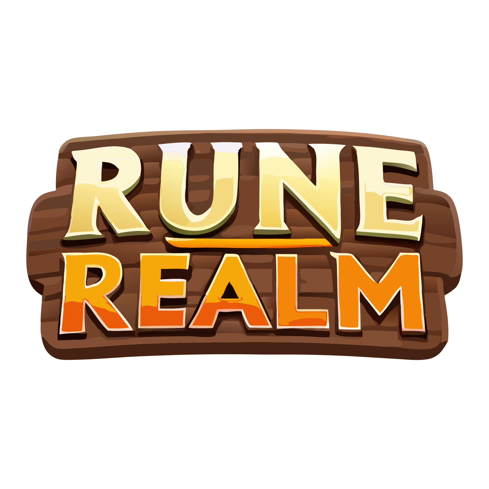

# RuneRealm - The #1 Onchain MMORPG



A responsive and modern landing page for RuneRealm, a blockchain-powered MMORPG where players truly own their gaming assets and experience through blockchain technology.

## 🎮 Project Overview

RuneRealm is an immersive MMORPG that combines traditional gaming elements with blockchain technology, allowing players to:

- Own in-game assets as NFTs
- Trade directly with other players
- Verify the authenticity and scarcity of digital assets
- Participate in a player-driven economy

This landing page showcases the key features and benefits of RuneRealm to potential players.

## 🚀 Technologies Used

- React
- TypeScript
- Styled Components
- Framer Motion
- React Intersection Observer
- FontAwesome

## 🔧 Setup and Installation

1. Clone the repository:
```bash
git clone https://github.com/your-username/rune-realm-landing-page.git
cd rune-realm-landing-page
```

2. Install dependencies:
```bash
npm install
```

3. Start the development server:
```bash
npm start
```

The app will be available at [http://localhost:3000](http://localhost:3000).

## 📦 Build for Production

To create a production build:

```bash
npm run build
```

The build artifacts will be stored in the `build/` directory.

## 📋 Project Structure

- `/src`
  - `/assets` - Images, videos, and other static assets
  - `/components` - Reusable React components
    - `/Button` - Custom button component
    - `/Features` - Features section
    - `/Footer` - Page footer
    - `/Hero` - Hero section with video background
    - `/Navbar` - Navigation bar
    - `/Ownership` - NFT ownership section
    - `/Roadmap` - Development roadmap
    - `/Socials` - Social media links
  - `/styles` - Global styles and themes
  - `App.tsx` - Main application component
  - `index.tsx` - Application entry point

## 🎨 Design Elements

- **Primary Color**: #ba7867
- **Secondary Color**: #705264
- **Design Theme**: Glassmorphism, game-oriented, blockchain-focused
- **Animations**: Scroll-based reveals and interactions
- **Responsiveness**: Fully responsive across all device sizes

## 🔗 Social Media Links

- Twitter/X: [https://x.com/runerealm_ao](https://x.com/runerealm_ao)
- Discord: [https://discord.gg/arc-ao](https://discord.gg/arc-ao)
- Telegram: [https://t.me/ArcAOGames](https://t.me/ArcAOGames)

## 📝 License

Copyright 2023 RuneRealm Team
